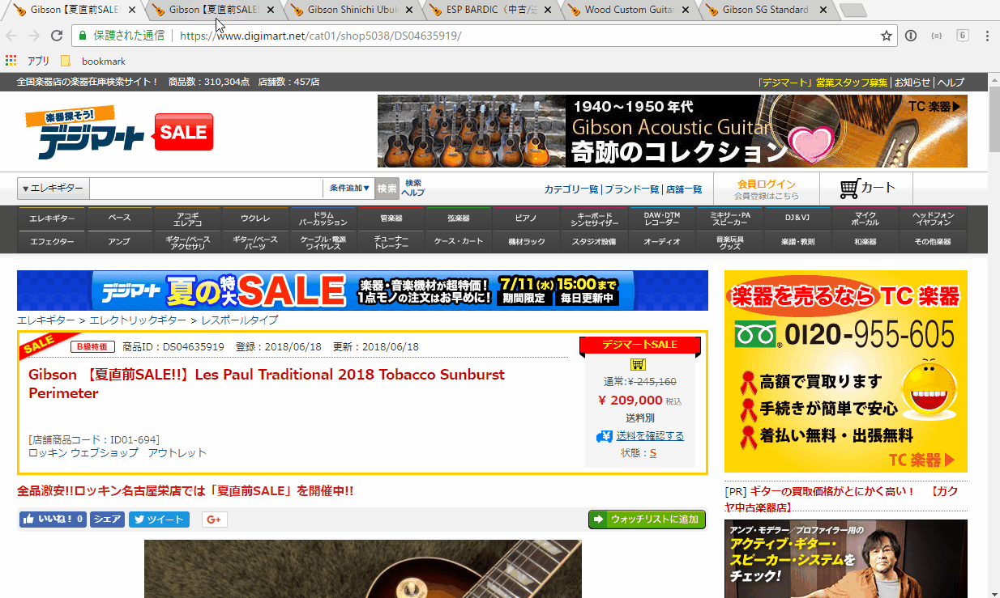
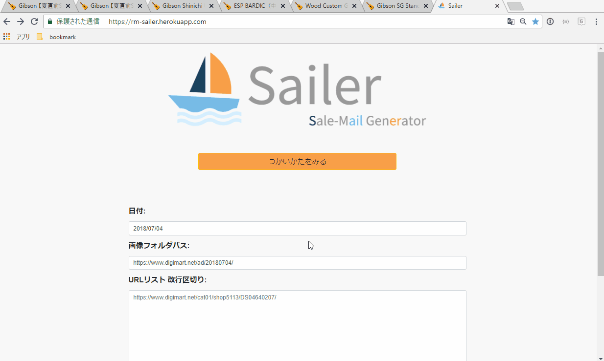
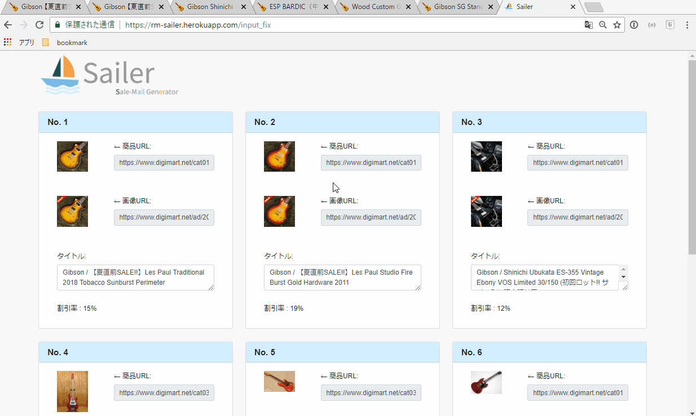

# Sailer


## Description
セールメールのHTMLをジェネレートするやつです  
Chromeのみ想定しています  
Chrome ExtensionのGetTabInfoを使うとグッと幸せ度が上がります。

## Usage

### 1 GetTabInfo 
urlリストをパコッとつくってくれるやつです

1. Chromeをひらきます
1. [GetTabInfo](https://chrome.google.com/webstore/detail/gettabinfo/iadhcoaabobddcebhmheikmbcjcigjhc "GetTabInfo")をExtensionに追加します
1. 新たなWindowを開き、商品ページを開きまくります。(タブの並びが掲載順になります)(商品ページ以外は開かないでください)
1. 右上のGetTabInfoのボタンからパネルをぴょこっと出し、上のTemplate欄に``` %%URL%%```と入力します。すると下のCode欄にURLが並ぶのでコピります

    

### 2 Sailer
1. [Sailer](https://rm-sailer.herokuapp.com/ "Sailer")をひらきます
1. 必要事項を埋めます
    + Usage-1で取ってきたURLのリストを欄にペーストします
    + メールの情報日時(最下部の注釈の部分)を設定します(デフォルトで今日の日付が入ります)
    + サムネ画像が入るフォルダを設定します(デフォルトで今日の日付が入ります)
    + 使うテンプレートをプルダウンから選びます
    1. 必要事項を埋めます
    
1. 送信ボタンをぽちります
1. 各商品のSubjectになる部分を適当に修正したら生成ボタンをぽちります
    
1. 幸せ(happy)になります

## Update Plans

+ テンプレート更新関係
    + 既存テンプレをダウンロードできるようにします
    + 新規テンプレをアップロードできるようにします
    + 選択されているテンプレをプレビューできるようにします
    
+ readme
    + usage画像を入れたい
    
## Licence
MIT

## Produced by
App : Rawashi  
   + hagiwara-ky [at] rittor-music.co.jp   

Icon : [flaticon](https://jp.freepik.com/free-icon/sail-boat_696407.html "flaticon") from www.flaticon.com  
Style : [Honoka](http://honokak.osaka/ "honoka") MIT Licence
